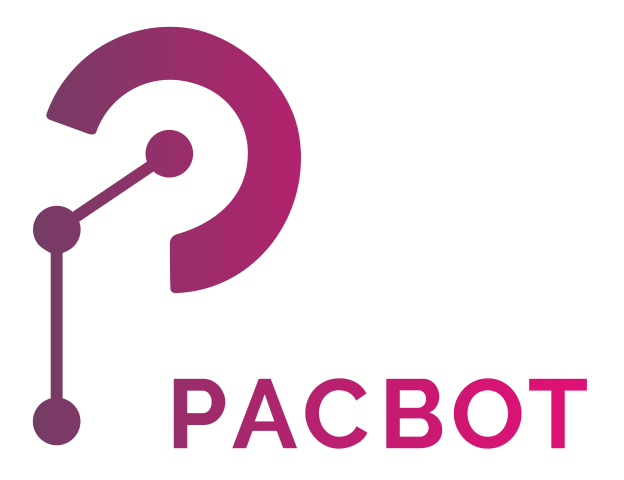
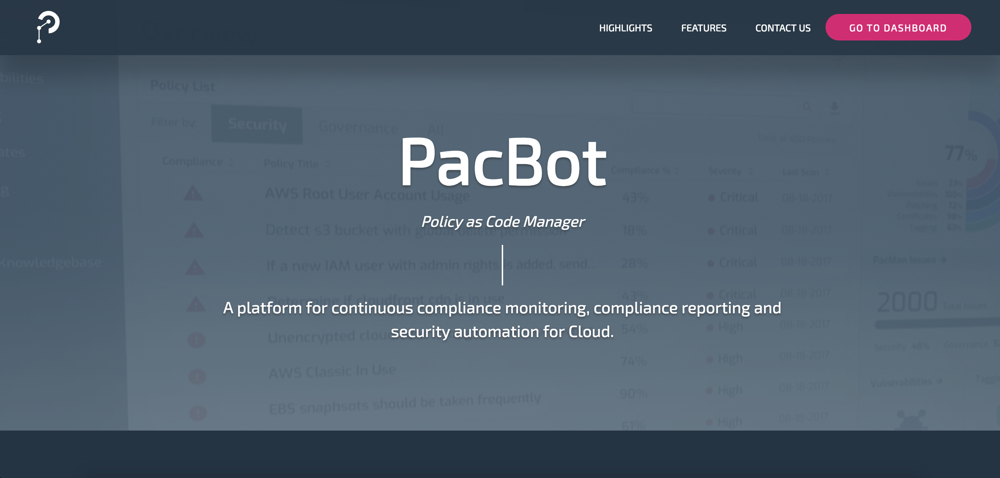

# PacBot
**Policy As Code Bot - Continuous Cloud Compliance**

PacBot is developed by T-Mobile US. PacBot stands for Policy as Code 
Bot, it is a platform for continuous compliance monitoring, compliance reporting and security
automation for Cloud. Security and Compliance policies are implemented as code. All cloud assets are
evaluated against these policies to gauge compliance. It gives a very simplified view of compliance and
makes it easy to analyze and remediate the policy violations. It can plot detailed compliance trends,
create perspectives to visualize compliance data by application, environment, organization, AWS account
or any custom scope. PacMan provides a framework as well to implement automatic fixes for policy
violations.

# Install

You can install PacBot using the automated [installer](https://github.com/tmobile/pacbot/wiki/Install).

## User Guide

For more details, see the [Wiki](https://github.com/tmobile/pacbot/wiki).

## License

PacBot is released under the [Apache 2.0 License](https://github.com/tmobile/pacbot/blob/master/LICENSE).
