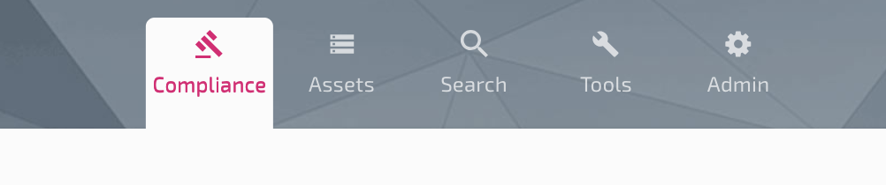

# webapp

This project was generated with [Angular CLI](https://github.com/angular/angular-cli) version 1.4.4.

## Project brief structure

This is a multi module project. These are the modules available:

- _App Module_: This is the mail module in which application is loading
    -  _Core Module_: This is a core module which is the backbone of the application and includes services which drive the application
    - _Landing Page Module_: This module contains pre login section of the module
    - _Post login Module_: This module sets the base of application once user logs in
    - Feature modules
        - Compliance
        - Assets
        - Omni Search
        - Admin
        - Tools
    - _Shared Module_: This module contans all components, services, constant files which are shared across the application

### Feature modules



All feature modules are configurable to be shown or hidden on need basis.

## Configurations

Application can be configured to suit your needs, These are the types of configurations available here:

 * _Auth type_: By default, if no values are set in auth configuration, a login screen will ask for username and password, if you have added PacMan to your azure ad, you can provide 'clientId' and 'tenant' values in configuration to enable SSO
 * _Feature modules visibility_: Each feature module can be configured to be displayed or hidden on need basis.
 * _Cloud domains_: Production, staging and dev environment domains can be configured here
 * _PacMan Issues_: This configuration is required if you want your users to create jira ticket for the issues reported by PacBot and send those issues to respective teams

All the configurations can be done at this [file](src/config/configuration.ts).
Check the details about each configuration value [here](https://github.com/tmobile/pacbot/wiki/UI-Configuration)

## Development & Build

### Setup the development environment
You need to set up your development environment before you can do anything.

Install [Node.js® and npm](https://nodejs.org/en/download/) if they are not already on your machine.

> Verify that you are running at least node 6.9.x and npm 3.x.x by running node -v and npm -v in a terminal/console window. Older versions produce errors, but newer versions are fine.

Then install the [Angular CLI](https://github.com/angular/angular-cli) globally. You can install angular cli using npm:
```
npm install -g @angular/cli
```

Then install [Bower](https://bower.io/) globally. You can install Bower using npm:
```
npm install -g bower
```

*Great, your base setup is done!*

### Setup Web app

If you are doing this setup, menas you have already cloned the repository.

Go to `webapp` folder from your terminal/console and run the following commands to install node and bower modules

```
npm install
bower install
```

Yay! you are good to start the application.

Before we proceed to running the application, one last check, look at the application [configuration](src/config/configurations.ts) and ensure required configurations have values, optional configuration can be skipped for now.

Check the details about each configuration value [here](https://github.com/tmobile/pacbot/wiki/UI-Configuration)

*Let's start the application!*

### Development server

Run `ng serve` for a dev server. Navigate to `http://localhost:4200/`. The app will automatically reload if you change any of the source files.

To change the environment: `ng serve --env={{environment}}`

`environment` in above coomand could take `dev/stg/prod`. These values belong to different environment files:
`dev` corresponds to `environment.ts`
`stg`corresponds to `environment.stg.ts`
`prod` corresponds to `environment.prod.ts`

### Build

Run `ng build --prod --aot=false` to build the project. The build artifacts will be stored in the `dist/` directory.

### Version your app

To version your app, you can run the below commands

```
npm run build-prod-patch // For deployment any patches, bug fixes, refactoring
npm run build-prod-minor // For any new features, without breaking backward compatibility
npm run build-prod-major // For any changes or updates without supporting backward incompatibility
```

### Running end-to-end tests

Run `ng e2e` to execute the end-to-end tests via [Protractor](http://www.protractortest.org/).

### Code scaffolding

Run `ng generate component component-name` to generate a new component. You can also use `ng generate directive|pipe|service|class|guard|interface|enum|module`.
